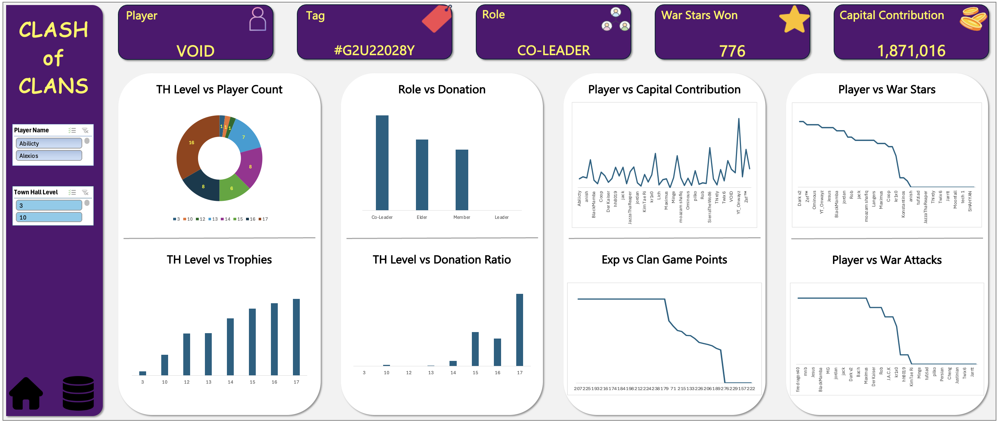

# CoC Analytics Project

Welcome to the **CoC Analytics Project** repository! 🚀  
This project showcases the end-to-end process of generating, transforming, and analyzing CoC data through a fully functional dashboard.

---
## 🚀 Project Requirements

#### Objective
To provide Clan Leader with a comprehensive analytical dashboard that will help him to make smarter decisions, reward top performers and guide the clan to grow stronger.


## 📊 Dashboard Design



#### 🧾 Overview

- How many players exist at each Town Hall level?
    
- How roles influence donation behaviour?
    
- Who contributes the most to clan capital?
    
- How TH level affects donation ratio?
    
- Whether higher-level players earn more clan game points?
    
- Who are the top war performers?
    
- How many players were actually active during war?

---
## 📖 Project Overview

This project involves:

1. **Raw Data Sourcing** — Creating a dataset of **50 players** using Power Query.
    
2. **Data Transformation & Cleansing** — Validating and standardising player details.
    
3. **Dashboard Development** — Building an Excel dashboard to visualise key insights.


🎯 **Core Focus Areas:**

- Data Cleansing and Transformation
    
- Clan Performance Metrics Modeling
    
- Performance Dashboard Visualization

---

## 📂 Repository Structure
```
CoC-Analytics-project/
│
├── CoC_Dashboard.drawio/               # Draw.io file for dashboard layout
│
├── icons/                              # Project files
│
├── README.md                           # Project overview and instructions
│
├── LICENSE                             # License information for the repository
```


---

## 🛡️ License

This project is licensed under the [MIT License](LICENSE). You are free to use, modify, and share this project with proper attribution.

## 🌟 About Me

Hi there! I'm **Ankit Khareshiya**. I’m a student who likes working with data.

Feel free to connect with me on the following platforms:

[](https://www.linkedin.com/in/ankit-khareshiya/) 
 
